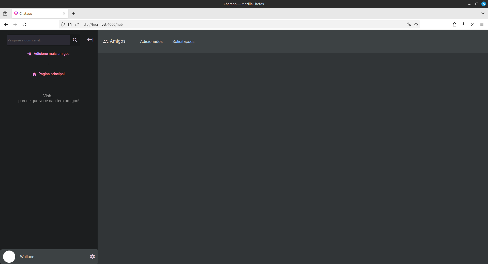
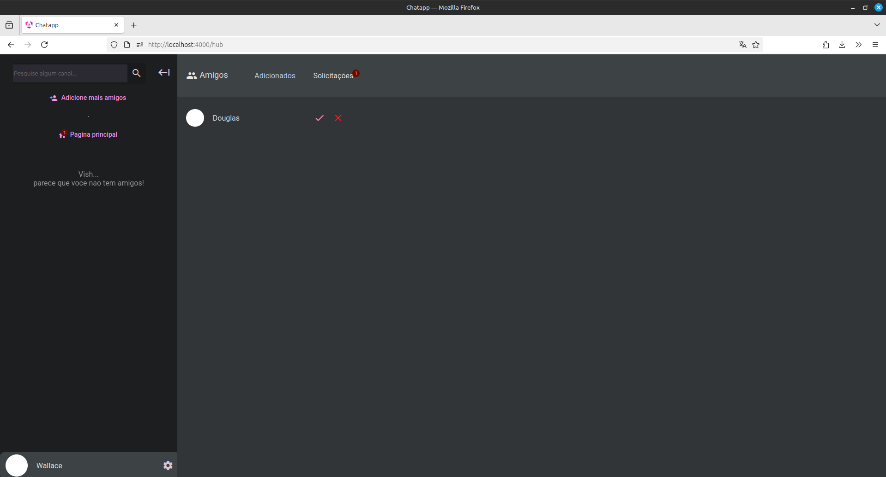

# ChatApp
## Sobre
Esse projeto se trata de um site de comunicação em tempo real entre usuarios, possuindo autenticação, capacidade de adicionar amigos, conversas privadas etc. O design foi bem inspirado no discord assim como a usabilidade.
## Como executar
### Docker
A forma principal de executar esse projeto é via docker compose, sendo apenas necessário clonar esse repositorio e no diretorio raiz executar:
```
sudo docker compose up --build
```
Após o build e as instancias ficarem disponiveis, o projeto ficará disponivel em:
https://localhost:4000/

## Tecnologias usadas:
- .NET 8
- ASP.NET
- C#
- RabbitMQ
- SignalR
- PostgreSQL
- Redis
- Nginx
- Docker
- Angular v20
- Angular Materials
- Typescript

## Imagens do projeto:




